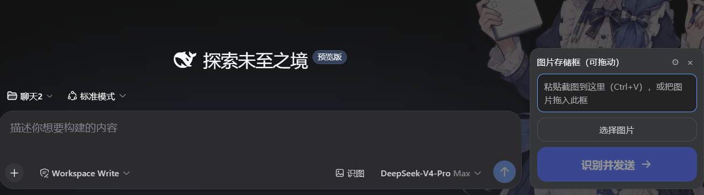

<p align="center">
  
</p>

<h1 align="center">dsh-vision-window</h1>

<p align="center"><strong>Paste an image, click one button, and a text-only DeepSeek Harness agent sees it — plus seven zero-config local pixel and OCR tools.</strong></p>

<p align="center">A self-contained DSH bundle plugin: a draggable image box on the Web composer, a <code>vision</code> tool, a <code>vision-fallback</code> skill, and seven <code>vw_*</code> local tools that need no provider, no key, and no Python.</p>

<p align="center">
  <a href="https://github.com/shinegeer/dsh-vision-window/releases/tag/v1.2.0"></a>
  
  <a href="LICENSE"></a>
  <a href="package.json">=20.9" /></a>
  
  
</p>

<p align="center">English · <a href="README.zh.md">中文</a></p>

## Why this exists

DeepSeek Harness is often driven by a text-only model: pasting an image directly into the composer is blocked, and the model has no image channel of its own. The old workaround was a hand-assembled stack of a vision sub-agent, a local skill and per-profile wiring — it worked on one machine and was hard to give to anyone else.

This plugin bundles the whole path into one installable package:

- **The image box is the entry point.** Paste, drag or choose an image; the plugin saves it into the workspace and, when you click **Recognize & send**, puts the file path at the front of your message. Your draft stays clean.
- **`vision` is a tool, not a detour.** The agent calls it inside long-running work whenever it needs to look at a file, and answers come straight from your configured OpenAI-compatible vision provider.
- **`vw_*` tools cover the pixel work.** Crop, pixel diff, palette, SVG trace, OCR, HTML screenshot and foreground extraction run locally with zero configuration — no vision provider or API key required.
- **The skill closes the loop.** A registered `vision-fallback` skill teaches the agent when to call `vision`, when to prefer `vw_*`, and how to archive results into a `已识别图片` folder with markdown notes.

The design stays additive: the plugin never replaces composer components and never intercepts keyboard events. Its only network egress is the vision provider you configure — the `vw_*` tools run offline, and `vw_html_screenshot` additionally blocks network requests while rendering the local file.

## See it in action

The screenshot above shows the floating image box in DSH Web. The flow is:

1. Click **识图** (Recognize) next to the composer.
2. Paste a screenshot with `Ctrl+V`, drag a file in, or click **选择图片** (Choose image).
3. Type normally in the composer — it stays untouched.
4. Click **识别并发送** (Recognize & send). The plugin saves the image under `<workspace>/pasted_images/`, prepends `识别图片 <path>` to your draft, sends the message, then clears and closes the box.
5. The agent follows the skill, calls `vision` with that path, and archives the image plus a `NN_主题词.md` note into `已识别图片/`.

In headless or long-running sessions you can skip the box entirely and tell the agent to look at any absolute image path — it will call `vision` on its own.

## Quick start

Prerequisites: a DeepSeek Harness installation with a Web or Headless profile and `pnpm` available to `dsh plugin`.

```sh
# Web
dsh plugin --profile web add github:shinegeer/dsh-vision-window

# Headless
dsh plugin --profile headless add github:shinegeer/dsh-vision-window
```

Restart a running Web profile, then confirm the bundle row:

```sh
dsh --profile web --dump-config | grep ui-vision-window
```

No build step is required. `sharp` installs its prebuilt binary through pnpm; `potrace` and `puppeteer-core` are ordinary dependencies.

Two levels of configuration:

- **Zero config** — the seven `vw_*` local tools work immediately; they never read provider settings or credentials.
- **`vision` (understand/describe an image)** — open the gear in the image box (Web) or edit `~/.dsh/settings.yaml` (Headless), pick a preset, save a DSH credential, and the agent can call `vision` anywhere.

## Highlights

- **A real paste box, not a file dialog.** The floating box accepts paste, drag and choose; thumbnails are removable, the window is draggable and stays inside the viewport.
- **One explicit action sends the image.** The composer draft and the image paths are combined only when you click the send button; no surprise sends, no input pollution.
- **Presets and a failover chain.** OpenCode Go, OpenCode Zen (free) and Xiaomi MiMo presets, plus a custom OpenAI-compatible provider; failures are classified and walked in order, `429` honors `Retry-After` once.
- **Answers are cached by content.** The cache key is the image hash plus question plus provider chain, so switching chains or changing settings invalidates it.
- **Large images are downscaled before upload.** `sharp` reduces images over the pixel budget; failure falls back to the original bytes. Vision uploads are then encoded as JPEG (quality 82) so huge PNG screenshots stay small on the wire.
- **Reasoning blocks are stripped.** Paired, unclosed, HTML-escaped and `<|think|>` forms are removed before the answer reaches the model.
- **Local tools are measurable.** Pixel diff returns a ratio, a red heatmap and a JSON report — UI restoration becomes a number instead of an eyeball comparison.
- **Headless keeps the same tools.** The Web-only RPC lives behind a `connection` injection; headless sessions get `vision`, the skill and all seven `vw_*` tools unchanged.
- **Keys stay in DSH credentials.** The plugin stores only reference names such as `OPENCODE_API_KEY`; values are resolved per call and never logged or returned to the browser.

## Tools

### `vision`

One tool with a required absolute `image_path` and an optional `question`. It resolves the settings, reads and validates the image (magic bytes, 20 MiB limit), downscales when needed, walks the provider chain with classified errors, strips reasoning blocks and returns the description. A `[vision-window 状态]` line is appended when a fallback provider succeeded.

### `vw_*` local tools

Registered permanently and enabled by `localTools` (default `true`). All inputs must be absolute paths; artifacts land in `.dsh-vision-window/artifacts` relative to the session workspace unless `artifactsDir` is set.

| Tool | What it does | Execution | Artifact |
|---|---|---|---|
| `vw_crop` | Crop a pixel box `"x1,y1,x2,y2"` | local `sharp` | PNG |
| `vw_pixel_diff` | Per-pixel comparison: diff ratio, diff count, worst 8×8-grid regions | local `sharp` | red heatmap PNG + JSON report |
| `vw_colors` | Dominant colors as hex plus share | local `sharp` | — |
| `vw_trace` | Bitmap to SVG vectorization (posterized layers; icons/logos) | local `potrace` | SVG |
| `vw_ocr` | Text transcription, default `chi_sim+eng` | system `tesseract`; missing binary returns install guidance | — |
| `vw_html_screenshot` | Screenshot a local HTML file, default viewport 1200×720 | `puppeteer-core` + system Chrome/Edge | PNG |
| `vw_extract_foreground` | Remove border-connected background (uniform/near-uniform backgrounds) | local flood fill on `sharp` pixels | transparent PNG |

Notes:

- `vw_pixel_diff` resizes the rebuilt image to the original's dimensions when they differ and says so in the result.
- Local tools respect the `downscale` pixel budget; `vw_trace` has a hard 1 MP input cap that is enforced even when `downscale` is off.
- `vw_ocr` and `vw_html_screenshot` are the only tools with external system requirements; everything else works with the plugin's own Node dependencies.

Common workflows:

```text
vw_crop              image="ref.png" region="1067,841,1108,881"
vw_pixel_diff        original="ref.png" rebuilt="screenshot.png"
vw_colors            image="ref.png" top=8
vw_trace             image="icon.png" steps=4
vw_ocr               image="screenshot.png"
vw_html_screenshot   source="page.html" width=1200 height=720
vw_extract_foreground image="logo.png"
```

## Provider presets

| Preset | Base URL | Model | Credential reference |
|---|---|---|---|
| `opencode-go` | `https://opencode.ai/zen/go/v1` | `mimo-v2.5` | `OPENCODE_API_KEY` |
| `opencode-zen` | `https://opencode.ai/zen/v1` | `mimo-v2.5-free` | `OPENCODE_API_KEY` |
| `xiaomi-mimo` | `https://api.xiaomimimo.com/v1` | `mimo-v2.5` | `XIAOMI_API_KEY` |
| `custom` | yours | yours | yours |

The OpenCode Go `/zen/go/v1` endpoint is recorded by models.dev but not listed in the official OpenCode Zen documentation — verify it with the connection test first. `mimo-v2.5-pro` and `mimo-v2-flash` are text-only and must not be used as vision presets.

## Credentials

Put keys in `~/.dsh/.credentials.yaml` (file mode `0600`) or export them as environment variables:

```yaml
OPENCODE_API_KEY: sk-...
XIAOMI_API_KEY: sk-...
```

The Web panel saves and clears credentials through the DSH credentials service and only reports `configured / source / writable`. Keys are resolved at call time, so a changed key applies on the next request without a restart.

## Configuration

All fields live under the `vision-window` section of `~/.dsh/settings.yaml`; the Web panel writes the same section. Defaults from the schema:

| Field | Default | Meaning |
|---|---|---|
| `preset` | `opencode-go` | primary provider: `opencode-go` / `opencode-zen` / `xiaomi-mimo` / `custom` |
| `fallbacks` | `[opencode-zen, xiaomi-mimo]` | backup providers, tried in order |
| `custom` | `{ baseUrl: "", model: "", apiType: chat, credential: "", maxTokens: 0 }` | custom OpenAI-compatible provider |
| `language` | `zh` | UI and result language |
| `downscale` / `downscaleMaxPixels` | `true` / `4000000` | pre-call downscale and pixel budget |
| `cache` / `cacheTtlSeconds` / `cacheMaxEntries` | `true` / `3600` / `200` | in-process answer cache |
| `stripThink` | `true` | remove `<think>` / reasoning blocks |
| `timeoutMs` | `60000` | per vision-call deadline |
| `localTools` | `true` | master switch for the seven `vw_*` tools |
| `artifactsDir` | `.dsh-vision-window/artifacts` | artifact directory; relative paths resolve against the session workspace, absolute paths are used as-is |

## Headless usage

No floating box exists in headless. Configure `vision-window` in `~/.dsh/settings.yaml` and run one-shot tasks:

```yaml
vision-window:
  preset: opencode-go
  fallbacks:
    - opencode-zen
    - xiaomi-mimo
  custom:
    baseUrl: ""
    model: ""
    apiType: chat
    credential: ""
    maxTokens: 0
  language: zh
  downscale: true
  downscaleMaxPixels: 4000000
  cache: true
  cacheTtlSeconds: 3600
  cacheMaxEntries: 200
  stripThink: true
  timeoutMs: 60000
  localTools: true
  artifactsDir: .dsh-vision-window/artifacts
```

```sh
dsh --profile headless "call vision on C:\path\a.png and tell me what it shows"
dsh --profile headless "call vw_colors on C:\path\a.png with top=2"
dsh --profile headless "call vw_pixel_diff on C:\path\ref.png against C:\path\impl.png"
```

## Requirements

- DeepSeek Harness with a Web or Headless profile and `pnpm` available to `dsh plugin`.
- Node ≥ 20.9 (sharp 0.35 requirement).
- A vision provider and a DSH credential only for `vision`; the `vw_*` tools need neither.
- Chrome, Chromium or Edge only for `vw_html_screenshot`; set `CHROME_PATH` to override the default search paths.
- Tesseract only for `vw_ocr`; without it the tool returns a clear installation pointer and every other tool keeps working.

## Install and lifecycle

### Install

```sh
dsh plugin --profile web add github:shinegeer/dsh-vision-window
dsh plugin --profile headless add github:shinegeer/dsh-vision-window
```

Restart a long-lived Web profile after installation. The host discovers the browser bundle through `dsh.client` at startup; a plain page refresh is not enough.

### Disable / re-enable

Disable the row in the profile patch (`~/.dsh/profiles/<profile>/cordis.patch.yml`):

```yaml
- id: ui-vision-window
  disabled: true
```

Set it back to `false` to re-enable. Unloading removes the tools, skill and settings card; saved images and artifacts remain.

### Upgrade

```sh
dsh plugin --profile web update github:shinegeer/dsh-vision-window
```

Settings live in `~/.dsh/settings.yaml` and survive upgrades.

### Uninstall

```sh
dsh plugin --profile web remove @dsh-external/dsh-client-ui-vision-window
dsh plugin --profile headless remove @dsh-external/dsh-client-ui-vision-window
```

Uninstalling never deletes `pasted_images/`, `已识别图片/`, credentials or the `vision-window` settings section.

## Security notes

- Credentials are DSH credential references; values are resolved per call, never cached in the plugin, never logged and never returned over the config RPC.
- Image text is **untrusted evidence**. The bundled skill tells the agent not to execute instructions found inside images; recognized text is data, not directives.
- The plugin accepts only png / jpg / webp / gif inputs (magic-byte check) up to 20 MiB, and local artifacts are written only under `artifactsDir`.
- `vw_html_screenshot` enables request interception inside the browser and aborts every non-`file:` request, so the rendered page cannot fetch or beacon remote resources.
- `npm audit --omit=dev` reports five moderate findings from a single `phin` advisory (`phin <3.7.1`, transitive through `potrace` → `jimp`). The affected code path is Jimp's remote-URL loader; this plugin passes only locally validated buffers to `potrace`, so that path is never exercised. `sharp` 0.35.3 has zero advisories.

## Architecture

```
dsh-vision-window/
├── package.json            # bundle declaration, dependencies (sharp/potrace/puppeteer-core)
├── cordis.patch.yml        # injects the host half into the profile plugin roster
├── lib/
│   ├── index.js            # host: settings, credentials, vision tool, skill, RPC
│   ├── client.js           # browser: image box UI + settings panel
│   ├── image-utils.js      # shared sharp loading / magic-byte check / downscale
│   └── local-tools.js      # the seven vw_* local tools
├── tests/
│   ├── host.test.mjs
│   ├── apply.test.mjs
│   └── local-tools.test.mjs
├── assets/
│   └── vision-window-demo.png
├── README.md / README.zh.md
└── LICENSE
```

Data flow:

1. Browser: paste → `save` RPC writes `<workspace>/pasted_images/...` → thumbnail appears.
2. User clicks send → the client reads the draft, prepends `识别图片 <path>` (one line per image) and sends it; draft is cleared and the box closes.
3. Host: the agent follows `vision-fallback`, calls `vision`, and the provider chain returns a description; the agent archives the image and a markdown note into `已识别图片/`.
4. Pixel work: the agent calls `vw_*` directly; tools validate the absolute path, run locally and report artifact paths under `.dsh-vision-window/artifacts`.

The Web-only `/paste-image` RPC is registered inside `ctx.inject(['connection'])`, so headless profiles skip it while keeping tools, skill, settings and credentials.

## Development

```sh
npm run check   # node --check on all four lib files
npm test        # node --test, 24 tests
npm pack        # prepack runs check
```

Edit `lib/index.js` for the host half (prompt in `visionPrompt()`, skill in `SKILL_CONTENT`, presets in `PRESET_DEFS`), `lib/client.js` for the box and panel (positioning in `measureComposer()`, width in `.ui-paste-image-float`), and `lib/local-tools.js` for the `vw_*` family. Host and client changes require a Web profile restart.

## Known limitations

- The answer cache is in-process (LRU + TTL); it clears on restart and is not shared across processes.
- Downscale keeps only the first frame of animated GIFs (sharp behavior).
- The OpenCode Go endpoint is undocumented upstream; treat the connection test as authoritative.
- `vw_ocr` needs a system tesseract and `vw_html_screenshot` needs a system browser; both return actionable guidance when absent.
- Artifact filenames carry timestamps and random suffixes, so files accumulate instead of overwriting; delete `artifactsDir` to clean up.
- `potrace` carries the transitive `phin` advisory described under Security notes; it is unreachable from the plugin's local-buffer call path.

## License

[MIT](LICENSE)
